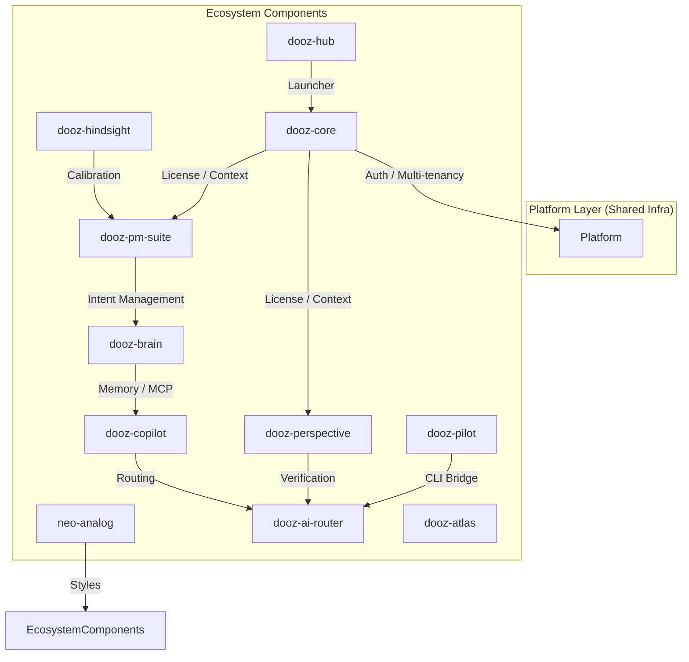

# Dooz Ecosystem Architecture

The Dooz architecture follows a decentralized model where canonical components orbit a shared platform infrastructure. Each component is responsible for its own domain logic while relying on the platform for cross-cutting concerns.

## Conceptual Interaction Map

This map illustrates how the various components interact at a high level.

## Architectural Philosophy

### 1. Orbit Pattern
Components do not directly own infrastructure like identity providers or billing engines. Instead, they "orbit" the platform foundation, which provides these services as a commodity.

### 2. Isolated Context
Every interaction within the ecosystem is tenant-scoped. components must never leak data across tenant boundaries, a principle enforced by the platform's isolation layer.

### 3. Asymmetric Intelligence
Intelligence is distributed but asymmetric:
- **Centralized Routing**: LLM interactions are mediated through `dooz-ai-router`.
- **Localized Memory**: Organizational context is maintained by `dooz-brain`.
- **Specialized Synthesis**: domain-specific logic resides in components like `dooz-perspective`.

### 4. Deterministic Flow
While AI is used for synthesis and guidance, the core business flows (licensing, data updates, decision logging) remain deterministic and auditable.

---

> [!NOTE]
> For details on the boundary between the ecosystem and platform, see [Platform Boundaries](./Platform_Boundaries.md).

*Last updated: 2026-01-15*
