# DOOZ Ecosystem - C4 Container Diagram

> **Level 2: Container** — Shows the high-level technology choices and how containers (applications/data stores) interact.

---

## Overview

This diagram shows the runtime containers within the DOOZ ecosystem boundary, including web applications, desktop applications, databases, and infrastructure services.

---

## C4 Container Diagram

```mermaid
C4Container
    title Container diagram for DOOZ Ecosystem
    
    %% People
    Person(developer, "Developer", "Uses DOOZ tools")
    Person(pm, "Project Manager", "Manages projects")
    
    %% Container Boundaries
    Container_Boundary(web_apps, "Web Applications") {
        Container(core_web, "dooz-core", "PHP/Laravel, Blade", "Multi-tenant SaaS platform")
        Container(pm_web, "PM Suite UI", "React, Vite", "Project management interface")
    }
    
    Container_Boundary(desktop_apps, "Desktop Applications") {
        Container(hub, "dooz-hub", "Tauri 2.0, React", "Desktop launcher dashboard")
        Container(brain, "dooz-brain", "Tauri 2.0, React", "Knowledge management app")
        Container(pilot, "dooz-pilot", "Tauri 2.0, React", "CLI orchestrator")
    }
    
    Container_Boundary(api_services, "API Services") {
        Container(core_api, "Core API", "PHP/Laravel", "REST API for platform")
        Container(pm_api, "PM Suite API", "Bun, Hono", "REST API for PM")
        Container(bridge_api, "Bridge API", "Bun, Hono", "Event bus API")
        Container(router_api, "AI Router", "Bun, TypeScript", "LLM routing service")
    }
    
    Container_Boundary(ai_platform, "AI Platform") {
        Container(ai_api, "AI Platform API", "Python, FastAPI", "Agent orchestration")
        Container(mcp_server, "MCP Server", "TypeScript", "Model Context Protocol")
    }
    
    Container_Boundary(data, "Data Storage") {
        ContainerDb(postgres, "PostgreSQL", "PostgreSQL 15+", "Core tenant data")
        ContainerDb(sqlite, "SQLite", "SQLite", "Local/desktop data")
        ContainerDb(redis, "Redis", "Redis 7+", "Cache and sessions")
        ContainerDb(chroma, "ChromaDB", "Vector DB", "Embeddings for RAG")
    }
    
    %% External
    System_Ext(llm_apis, "LLM APIs", "OpenAI, Anthropic, etc.")
    
    %% Relationships
    Rel(developer, hub, "Uses")
    Rel(developer, core_web, "Manages via")
    Rel(pm, pm_web, "Manages projects")
    Rel(pm, brain, "Reviews knowledge")
    
    Rel(hub, bridge_api, "Publishes events to")
    Rel(hub, router_api, "Routes AI requests to")
    
    Rel(pm_web, pm_api, "Calls")
    Rel(pm_web, brain, "Queries context from")
    
    Rel(core_web, core_api, "Calls")
    Rel(core_api, postgres, "Reads/Writes")
    Rel(core_api, redis, "Caches in")
    
    Rel(pm_api, postgres, "Reads/Writes")
    Rel(pm_api, bridge_api, "Publishes events to")
    
    Rel(bridge_api, sqlite, "Persists events in")
    Rel(bridge_api, brain, "Delivers webhooks to")
    
    Rel(brain, chroma, "Stores embeddings in")
    Rel(brain, mcp_server, "Exposes tools via")
    
    Rel(router_api, llm_apis, "Routes requests to")
    Rel(router_api, redis, "Caches in")
    
    Rel(ai_api, router_api, "Uses")
    Rel(ai_api, mcp_server, "Calls tools via")
    
    Rel(pilot, brain, "Gets context from")
    Rel(pilot, bridge_api, "Publishes commands to")
    
    UpdateLayoutConfig($c4ShapeInRow="3", $c4BoundaryInRow="2")
```



---

## Container Descriptions

### Web Applications

| Container | Technology | Responsibility |
|-----------|-----------|----------------|
| **dooz-core** | PHP 8.2, Laravel 12, Blade | Multi-tenant SaaS platform with admin UI |
| **PM Suite UI** | React 18, Vite, TypeScript | Project management interface |

### Desktop Applications

| Container | Technology | Responsibility |
|-----------|-----------|----------------|
| **dooz-hub** | Tauri 2.0, Rust, React | Desktop launcher with tiles |
| **dooz-brain** | Tauri 2.0, Rust, React | Knowledge management and RAG |
| **dooz-pilot** | Tauri 2.0, Rust, React | CLI orchestrator and terminal |

### API Services

| Container | Technology | Responsibility |
|-----------|-----------|----------------|
| **Core API** | PHP/Laravel | Tenant management, auth, billing |
| **PM Suite API** | Bun, Hono, Drizzle | Intent/decision management |
| **Bridge API** | Bun, Hono, SQLite | Event bus and webhooks |
| **AI Router** | Bun, TypeScript, Zod | LLM provider routing |

### AI Platform

| Container | Technology | Responsibility |
|-----------|-----------|----------------|
| **AI Platform API** | Python 3.11, FastAPI | Agent orchestration |
| **MCP Server** | TypeScript | Model Context Protocol server |

### Data Stores

| Container | Technology | Data Stored |
|-----------|-----------|-------------|
| **PostgreSQL** | PostgreSQL 15+ | Tenant data, users, billing |
| **SQLite** | SQLite | Local events, desktop state |
| **Redis** | Redis 7+ | Sessions, cache, rate limits |
| **ChromaDB** | Vector DB | Document embeddings |

---

## Communication Patterns

### 1. Synchronous (REST API)
```
Web UI → API Service → Database
```
Used for: CRUD operations, queries, immediate responses

### 2. Asynchronous (Event-Driven)
```
Service → Bridge → Webhook → Consumer
```
Used for: Cross-service communication, decoupled updates

### 3. MCP (Model Context Protocol)
```
AI Agent → MCP Server → Tool Execution
```
Used for: AI tool calling, context provision

### 4. Desktop IPC
```
React Frontend ↔ Tauri Backend ↔ System APIs
```
Used for: Desktop apps, file system, native features

---

## Deployment Architecture

### Web Services
- Docker containers
- Load balancer (nginx)
- Horizontal scaling support

### Desktop Apps
- Tauri binaries
- Auto-updater
- Cross-platform (Windows, macOS, Linux)

### Databases
- PostgreSQL: Managed service or container
- SQLite: Embedded per-instance
- Redis: Container or managed cache
- ChromaDB: Containerized vector store

---

## Technology Choices

### Why PHP/Laravel for Core?
- Mature ecosystem for SaaS
- Built-in auth and tenancy
- Large talent pool

### Why Tauri for Desktop?
- Smaller bundle size than Electron
- Rust backend performance
- Native OS integration

### Why Bun for Services?
- Fast startup time
- TypeScript native
- Modern JavaScript APIs

### Why Python for AI?
- Dominant ML ecosystem
- FastAPI for modern APIs
- Agent frameworks

---

## Next Level

See [C4 Component Diagrams](./C4_Components.md) for internal component structure of each container.

---

**Maintainer:** Architecture Team  
**Last Updated:** 2026-02-24  
**Version:** 1.0
