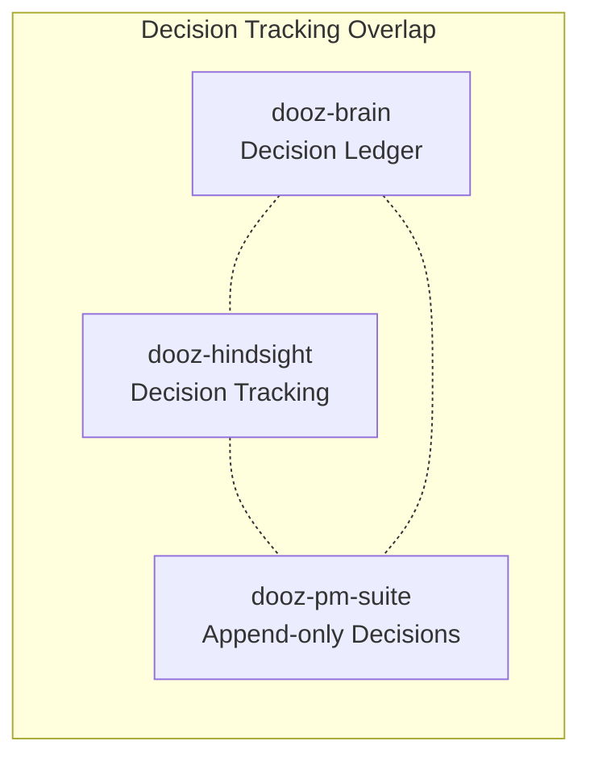

# Convergence & Platform Roadmap

> **Ralph Loop Analysis** — January 2026  
> Status: Convergence Phase → AI Native Business Suites Platform

---

## Executive Summary

The Dooz ecosystem contains **11 canonical components** and **4 lab experiments**. This analysis identifies:

> [!IMPORTANT]
> **Strategic Vision Update**: Beyond dogfooding, Dooz evolves into an **AI Native Business Suites Ecosystem Platform** — eventually hosting layman-centric applications (dooz-accountant, compliance suite, etc.).

**Convergence Priorities (Revised):**
- **Spine**: dooz-core, dooz-atlas, neo-analog (foundational)
- **P0 Priority**: dooz-pm-suite (run Dooz work via intent-based PM)
- **Active Evolution**: dooz-brain, dooz-pilot, dooz-ai-router
- **Park for Later**: dooz-hub, dooz-hindsight, dooz-perspective (not killed)
- **Labs → Parked**: All experiments retained for future consideration
- **Special Cases**: dooz-copilot → nonomous-ai, dooz-ballpark-ai → SaaS product

**Platform Vision**: AI Native Business Suites Ecosystem — future end-user apps include dooz-accountant, compliance suite, and more.

---

## 1. Inventory

### Canonical Ecosystem Components

| Component | Responsibility | Tech Stack | Maturity |
|-----------|---------------|------------|----------|
| **dooz-core** | Multi-tenant SaaS platform with auth, licensing, marketplace | Laravel 12, PHP 8.2 | High |
| **dooz-brain** | Local-first organizational memory + MCP server | Tauri, React, SQLite, Rust | Medium |
| **dooz-hub** | Personal launcher dashboard | Tauri 2.0, React | Medium |
| **dooz-pilot** | CLI wrapper for AI tools (Aider, Claude, etc.) | Tauri 2.0, React, PTY | Medium |
| **dooz-copilot** | Chat interface for Brain queries | React, Vite | Low |
| **dooz-hindsight** | Decision tracking & calibration | React, Vite | Low |
| **dooz-perspective** | Multi-LLM document verification | Bun, Hono | Medium |
| **dooz-pm-suite** | Intent-based project management | Bun, Hono, Drizzle | Low |
| **dooz-ai-router** | LLM routing library | TypeScript | Medium |
| **dooz-atlas** | Documentation repository + viewer | React, Vite, Markdown | High |
| **neo-analog** | CSS-first design system | Pure CSS | High |

### Lab Experiments

| Experiment | Question Being Explored | Status |
|------------|------------------------|--------|
| **dooz-ballpark-ai** | Can we provide instant AI-powered quotations for service companies? | Incomplete (Laravel + FastAPI + Vue + Widget) |
| **dooz-iot** | Can we build IoT platform components for edge devices? | Skeleton only |
| **dooz-meet** | Can we extract intelligence from meeting recordings? | Prototype |
| **dooz-oracle** | Can we wrap AI outputs with confidence scoring? | Concept (overlaps with existing patterns) |

---

## 2. Overlap & Redundancy Detection

### Critical Overlaps in Canonical



| Overlap | Components | Assessment |
|---------|-----------|------------|
| **Decision Recording** | dooz-brain, dooz-hindsight, dooz-pm-suite | Three separate decision systems. Brain has Decision Ledger, Hindsight tracks predictions, PM Suite has append-only ledger. |
| **Chat/Copilot Interface** | dooz-copilot, dooz-pilot | Copilot is Brain-specific chat. Pilot wraps general CLI. Minimal overlap but fragmented AI interaction surfaces. |
| **Memory/Knowledge** | dooz-brain, dooz-pm-suite | Brain has wiki/memory. PM Suite has knowledge graph. Not integrated. |

### Lab-to-Canonical Conflicts

| Experiment | Conflicts With | Notes |
|------------|---------------|-------|
| **dooz-oracle** | Existing patterns in dooz-perspective, dooz-ai-router | Perspective already has confidence scoring. Oracle is redundant abstraction. |
| **dooz-meet** | dooz-brain ingestion | Brain already supports document/email ingestion. Meeting extraction is compatible but not essential. |
| **dooz-ballpark-ai** | None | Separate product concept, not ecosystem utility. |
| **dooz-iot** | None | Unrelated domain. |

---

## 3. Spine Identification

The **minimal spine** required for DoozieSoft to run its own work:

### Essential (SPINE)

| Component | Justification |
|-----------|--------------|
| **dooz-core** | SSO for all internal tools. Tenant = DoozieSoft. Licensing governs access to internal apps (quicky, worklog). Already exists and is functioning. |
| **dooz-atlas** | Central knowledge base for SOPs, guides, and ecosystem docs. Essential for AI agent context and human reference. In active use. |
| **neo-analog** | Unified visual language across all tools. CSS-first means zero build cost for adoption. Already integrated in most projects. |

### Essential (ACTIVE EVOLUTION)

| Component | Justification |
|-----------|--------------|
| **dooz-brain** | MCP server is the only current mechanism for AI agents to access institutional memory. Local-first means no hosting cost. Critical for dogfooding AI workflows. |
| **dooz-ai-router** | Library dependency for any AI-calling code. Unified interface simplifies model switching. |
| **dooz-pilot** | Primary dev tool for using Aider, Claude, etc. DoozieSoft developers should dogfood this daily. |

### Park for Later (Retained, Not Killed)

| Component | Status | Future Potential |
|-----------|--------|------------------|
| **dooz-hub** | Parked | Personal utility app. May become client launcher in platform vision. |
| **dooz-hindsight** | Parked | Calibration scoring for end-user decision support. Future compliance/audit potential. |
| **dooz-perspective** | Parked | Document verification for compliance suite, contract review apps. |

### Special Relocations

| Component | Destination | Notes |
|-----------|-------------|-------|
| **dooz-copilot** | **nonomous-ai** | Must become autonomous. Moves from Dooz ecosystem to nonomous-ai project. |
| **dooz-pm-suite** | **P0 EVOLVE** | Main priority — required to run Dooz work. See Convergence Decisions. |

---

## 4. Gap Analysis

### True Gaps (Blocking Dogfooding)

| Gap | Impact | Component Affected |
|-----|--------|-------------------|
| **No Brain sync to cloud** | Single machine. No team sharing. | dooz-brain |
| **No cross-tool authentication** | Each tool requires separate login or no login. | dooz-core integration missing in Tauri apps |
| **No worklog in use** | Time tracking package exists in dooz-core but not integrated into developer workflow. | dooz-core/worklog |
| **Pilot lacks session persistence** | PTY sessions lost on app restart. | dooz-pilot |

### Nice-to-Have (Not Blocking)

| Feature | Classification | Notes |
|---------|---------------|-------|
| Meeting intelligence (dooz-meet) | Nice-to-have | Manual notes suffice. |
| IoT platform (dooz-iot) | Out of scope | Not relevant to software company. |
| Confidence scoring middleware (dooz-oracle) | Nice-to-have | Already ad-hoc in perspective. |
| Quotation engine (dooz-ballpark-ai) | Out of scope | Product concept, not internal tool. |

---

## 5. Convergence Decisions

### P0 PRIORITY — Main Focus

| Component | Action | Justification |
|-----------|--------|---------------|
| **dooz-pm-suite** | Full development push | Required to run Dooz work. Intent-based PM is the operational backbone. |

### ACTIVELY EVOLVE

| Component | Action | Priority |
|-----------|--------|----------|
| **dooz-brain** | Ship v1.5 stable. Cloud sync deferred. | P1 |
| **dooz-pilot** | Session persistence. Better grammar coverage. Daily driver polish. | P1 |
| **dooz-core** | Integrate worklog + quicky. PM Suite integration. | P1 |
| **dooz-ai-router** | Publish v1.0 to npm. Ensure all projects use it. | P2 |

### PARK FOR LATER (Not Killed)

| Component | Action | Future Use Case |
|-----------|--------|----------------|
| **dooz-hub** | Park | Client launcher, subscription dashboard |
| **dooz-hindsight** | Park | Compliance, audit calibration apps |
| **dooz-perspective** | Park | Document verification for professional suites |

### SPECIAL RELOCATIONS

| Component | Action | Notes |
|-----------|--------|-------|
| **dooz-copilot** | **Move to nonomous-ai** | Must be autonomous. No longer part of dooz-ecosystem. |

### LAB EXPERIMENTS (All Parked)

| Experiment | Decision | Future Potential |
|------------|----------|------------------|
| **dooz-oracle** | **PARK** | Confidence scoring middleware. Potential integration with Brain. |
| **dooz-iot** | **PARK** | Industrial/smart building apps. AU compliance for physical systems. |
| **dooz-meet** | **PARK** | Meeting intelligence. Integrate when Brain ingestion matures. |
| **dooz-ballpark-ai** | **→ SaaS PRODUCT** | High potential. Graduate to independent product repository. |

---

## 6. Platform Roadmap

> **Immediate Goal**: DoozieSoft runs its own work using Dooz tools.  
> **Platform Vision**: AI Native Business Suites Ecosystem with end-user applications.

### Phase 1: PM Suite Core (Weeks 1-3)

- [ ] **PM Suite becomes operational backbone**
  - Complete Intent CRUD + state machine
  - Decision ledger functional
  - DoozieSoft intents created for all current work

- [ ] **Atlas + Brain integration**
  - Atlas as documentation source
  - Brain ingests key decisions and context

### Phase 2: Developer Experience (Weeks 4-5)

- [ ] **Pilot daily driver**
  - Session persistence
  - Aider + Claude grammars
  - Brain MCP integration

- [ ] **Core internal tenant**
  - Worklog + Quicky enabled
  - Time tracking against PM Suite intents

### Phase 3: Platform Polish (Weeks 6-8)

- [ ] **Friction review & iteration**
  - Identify daily pain points
  - Fix top blockers

- [ ] **Copilot → nonomous-ai migration**
  - Transfer codebase
  - Reposition as autonomous agent

### Future: End-User Apps (Post-Dogfooding)

| Planned App | Domain | Notes |
|-------------|--------|-------|
| **dooz-accountant** | Accounting | AU-compliant bookkeeping for SMBs |
| **dooz-compliance** | Compliance | Regulatory tracking, audit trails |
| **dooz-contracts** | Legal | Contract management + perspective integration |
| *Additional apps* | TBD | Layman-centric, no technical expertise required |

---

## 7. Resolved Uncertainties

| Question | Resolution |
|----------|------------|
| Cloud sync priority | **Deferrable** — Single machine acceptable for now |
| PM Suite future | **P0 Priority** — Main focus, required to run Dooz |
| Ballpark AI positioning | **High-potential SaaS product** — Graduate to independent repo |
| Copilot deprecation | **Move to nonomous-ai** — Must become autonomous |
| Lab experiments | **All parked, not killed** — Retained for future |

---

## Summary Matrix

```
┌─────────────────────────────────────────────────────────────────┐
│                    CONVERGENCE DECISIONS                        │
├─────────────────┬──────────────┬────────────────────────────────┤
│ P0 / EVOLVE     │    PARKED    │          RELOCATE              │
├─────────────────┼──────────────┼────────────────────────────────┤
│ dooz-pm-suite ★ │ dooz-hub     │ dooz-copilot → nonomous-ai     │
│ dooz-brain      │ dooz-hindsight│ dooz-ballpark-ai → SaaS       │
│ dooz-pilot      │ dooz-perspective│                             │
│ dooz-core       │ dooz-oracle  │                                │
│ dooz-ai-router  │ dooz-iot     │                                │
│ dooz-atlas      │ dooz-meet    │                                │
│ neo-analog      │              │                                │
└─────────────────┴──────────────┴────────────────────────────────┘

★ = Main Priority
```

---

*Last updated: 2026-01-15*  
*Analysis by: Ralph (Recursive Ecosystem Analyst)*
