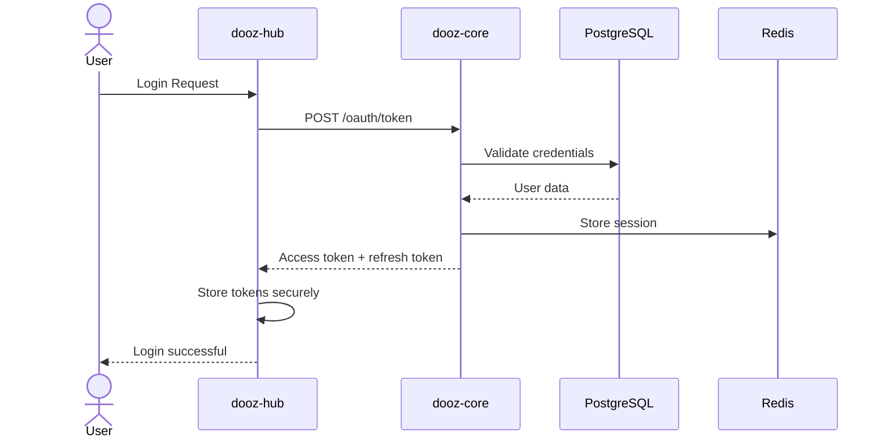
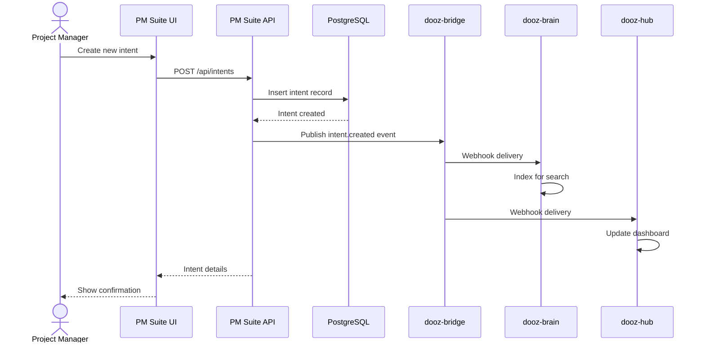
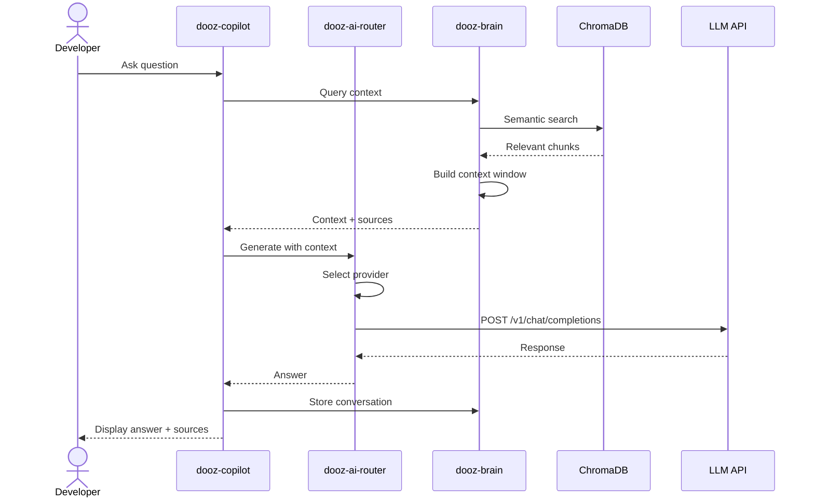
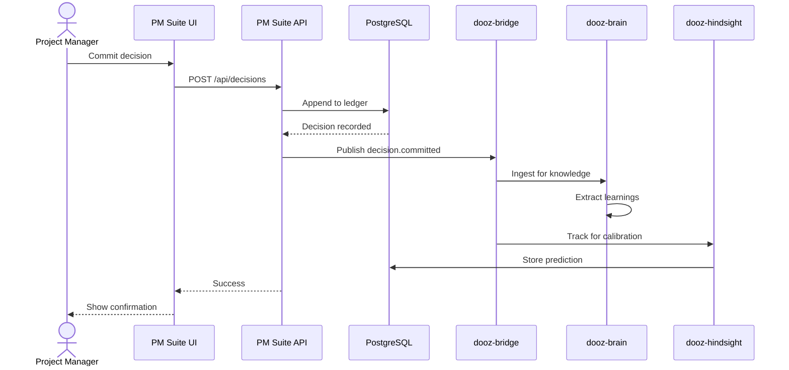
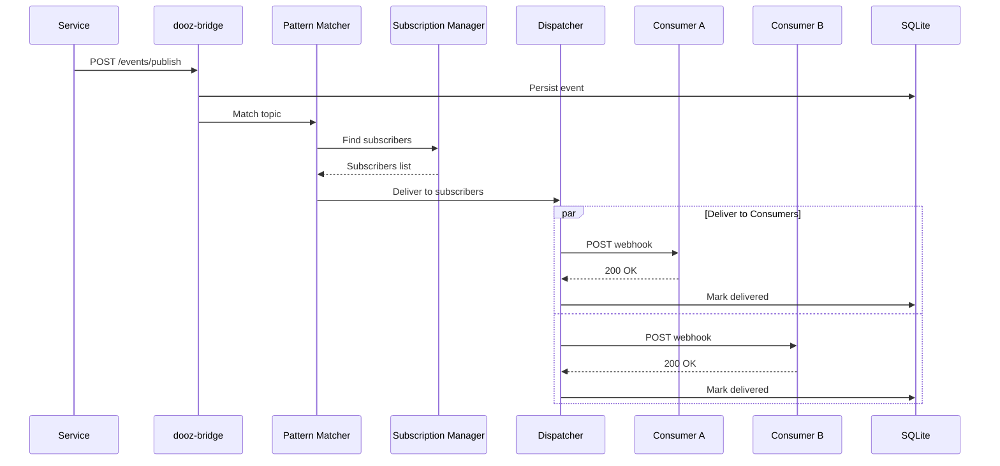
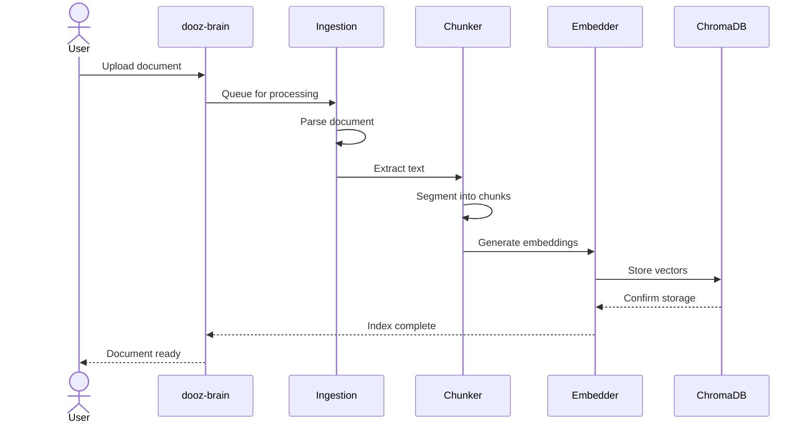
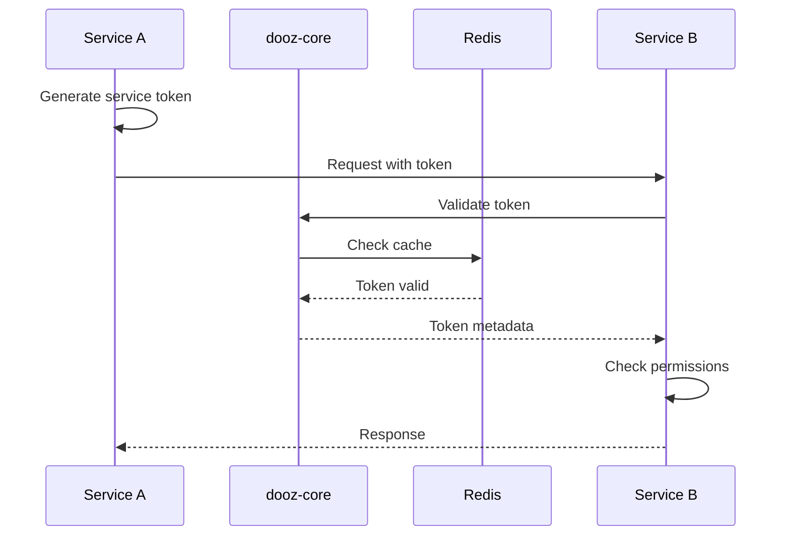

# DOOZ Ecosystem - Data Flow Documentation

> **System Interactions** — How data moves through the DOOZ ecosystem.

---

## Overview

This document describes the primary data flows within the DOOZ ecosystem, showing how information moves between modules during key operations.

---

## 1. User Authentication Flow

### Sequence



### Description

1. **User initiates login** from dooz-hub (or web)
2. **dooz-core** validates credentials against PostgreSQL
3. **Session stored** in Redis for fast validation
4. **OAuth2 tokens issued** (access + refresh)
5. **Tokens distributed** to client applications

### Data Stores

- **PostgreSQL**: User credentials, tenant associations
- **Redis**: Active sessions, token metadata

---

## 2. Intent Creation Flow

### Sequence



### Description

1. **PM creates intent** via PM Suite interface
2. **Intent persisted** to PostgreSQL
3. **Event published** to dooz-bridge
4. **Brain ingests** intent for knowledge graph
5. **Hub notified** to update UI
6. **Related services** react to event

### Event Payload

```json
{
  "topic": "intent.created",
  "payload": {
    "intentId": "uuid",
    "title": "Build feature X",
    "state": "research",
    "tenantId": "tenant-uuid",
    "createdBy": "user-uuid",
    "timestamp": "2026-02-24T10:00:00Z"
  }
}
```

---

## 3. AI Query with Context Flow

### Sequence



### Description

1. **Developer asks question** in dooz-copilot
2. **Brain retrieves** relevant context from ChromaDB
3. **Context assembled** with source attribution
4. **AI Router selects** best LLM provider
5. **Response generated** with grounded context
6. **Conversation stored** for future reference

### Context Assembly

```typescript
// Context window construction
const context = await brain.retrieveContext(query, {
  topK: 5,
  filters: { tenantId: currentTenant },
});

const prompt = `
Context from organizational knowledge:
${context.documents.map(d => `- ${d.content}`).join('\n')}

User question: ${query}

Provide a concise answer based on the context above.
Cite sources using [1], [2], etc.
`;
```

---

## 4. Decision Commit Flow

### Sequence



### Description

1. **PM commits decision** in PM Suite
2. **Decision appended** to immutable ledger
3. **Event published** to ecosystem
4. **Brain extracts** learnings and patterns
5. **Hindsight tracks** for calibration analytics

### Decision Schema

```json
{
  "decisionId": "uuid",
  "intentId": "uuid",
  "title": "Choose PostgreSQL over MySQL",
  "options": ["PostgreSQL", "MySQL", "SQLite"],
  "rationale": "Better JSON support",
  "confidence": 0.85,
  "predictedOutcome": "Faster development",
  "committedAt": "2026-02-24T10:00:00Z",
  "committedBy": "user-uuid"
}
```

---

## 5. Event Delivery Flow

### Sequence



### Description

1. **Service publishes** event to bridge
2. **Event persisted** to SQLite
3. **Topic matching** finds subscribers
4. **Parallel delivery** to all consumers
5. **Delivery tracked** for reliability

### Retry Logic

```typescript
// Exponential backoff
async function deliverWithRetry(event, subscriber, maxRetries = 5) {
  for (let attempt = 0; attempt < maxRetries; attempt++) {
    try {
      await deliverWebhook(event, subscriber);
      return { status: 'delivered' };
    } catch (error) {
      const delay = Math.pow(2, attempt) * 1000; // 1s, 2s, 4s...
      await sleep(delay);
    }
  }
  return { status: 'failed', moveToDLQ: true };
}
```

---

## 6. Document Ingestion Flow

### Sequence



### Description

1. **User uploads** document to Brain
2. **Document parsed** (PDF, MD, etc.)
3. **Text chunked** into segments
4. **Embeddings generated** for each chunk
5. **Vectors stored** in ChromaDB
6. **Searchable** immediately

### Processing Pipeline

```
Document Upload
    ↓
Format Detection (PDF, MD, TXT)
    ↓
Text Extraction
    ↓
Semantic Chunking (512 tokens, 50 overlap)
    ↓
Metadata Extraction (title, author, date)
    ↓
Embedding Generation (text-embedding-3-small)
    ↓
Vector Storage (ChromaDB)
    ↓
Index Confirmation
```

---

## 7. Cross-Service Authentication Flow

### Sequence



### Description

1. **Service A generates** JWT service token
2. **Service B validates** token with dooz-core
3. **Redis cache** prevents repeated validations
4. **Permissions checked** for requested resource
5. **Response returned** if authorized

---

## Data Store Responsibilities

| Store | Primary Use | Data Types |
|-------|-------------|------------|
| **PostgreSQL** | Tenant data, relations | Users, tenants, billing, PM data |
| **SQLite** | Bridge events, desktop | Events, deliveries, local state |
| **Redis** | Cache, sessions, rate limits | Sessions, cache, counters |
| **ChromaDB** | Vector search | Document embeddings |

---

## Event Topics Reference

| Topic | Publisher | Subscribers | Trigger |
|-------|-----------|-------------|---------|
| `user.login` | Core | All | User authentication |
| `intent.created` | PM Suite | Brain, Hub | New work item |
| `intent.transitioned` | PM Suite | Hub | Status change |
| `decision.committed` | PM Suite | Brain, Hindsight | Decision logged |
| `memory.ingested` | Brain | Hub | Knowledge updated |
| `document.uploaded` | Brain | - | New document |
| `package.installed` | Core | Hub | App installation |

---

## Performance Considerations

### Latency Targets

| Flow | Target | Actual |
|------|--------|--------|
| Authentication | <100ms | ~80ms |
| Intent Creation | <200ms | ~150ms |
| AI Query | <2s | ~1.5s |
| Event Delivery | <500ms | ~300ms |
| Document Ingestion | <5s/page | ~3s/page |

### Throughput

- **Events**: 1,000/second
- **AI Queries**: 100/second
- **Auth Requests**: 500/second

---

**Maintainer:** Architecture Team  
**Last Updated:** 2026-02-24  
**Version:** 1.0
