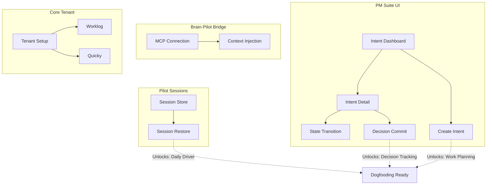

# Implementation Plan — Dooz Ecosystem Dogfooding

> **Ralph Analysis** — January 2026  
> Purpose: Actionable execution graph for AI-assisted development

---

## 1. System Readiness Scan

### Maturity Assessment

| Component | Status | Evidence |
|-----------|--------|----------|
| **dooz-pm-suite** | Partially Implemented | Schema complete (8 tables). Services functional. Missing: UI, Core integration. |
| **dooz-brain** | Partially Implemented | MCP server working. UI extensive. Missing: session persistence bugs, ingestion polish. |
| **dooz-pilot** | Partially Implemented | PTY core working. Cartridge system exists. Missing: session persistence, grammar coverage. |
| **dooz-core** | Usable | Multi-tenant platform running. Packages exist but need activation. |
| **dooz-atlas** | Usable | Viewer working. Documentation indexed. |
| **neo-analog** | Usable | Design tokens complete. CSS distributable. |
| **dooz-ai-router** | Usable | Library functional. Needs npm publish. |

### Readiness Matrix

```
┌─────────────────┬─────────────────┬─────────────────┐
│ USABLE AS-IS    │ PARTIAL         │ CONCEPTUAL      │
├─────────────────┼─────────────────┼─────────────────┤
│ dooz-core       │ dooz-pm-suite   │ (none blocking) │
│ dooz-atlas      │ dooz-brain      │                 │
│ neo-analog      │ dooz-pilot      │                 │
│ dooz-ai-router  │                 │                 │
└─────────────────┴─────────────────┴─────────────────┘
```

---

## 2. Capability Decomposition

### dooz-pm-suite (P0 Priority)

| Capability | Description | Current State |
|------------|-------------|---------------|
| **PMS-API** | REST API for intents, decisions, tasks | ✅ Implemented |
| **PMS-SCHEMA** | Database schema + migrations | ✅ Implemented |
| **PMS-INTENTS** | Intent CRUD + state machine | ✅ Implemented |
| **PMS-DECISIONS** | Append-only decision ledger | ✅ Implemented |
| **PMS-UI** | Web interface for PM operations | ❌ Missing |
| **PMS-CORE-AUTH** | dooz-core SDK integration | ⚠️ Middleware exists, untested |
| **PMS-AI-PROPOSALS** | AI proposal review queue | ⚠️ Schema exists, UI missing |

### dooz-brain

| Capability | Description | Current State |
|------------|-------------|---------------|
| **BRN-MCP** | MCP server for AI agents | ✅ Implemented |
| **BRN-INGEST** | Document ingestion pipeline | ✅ Implemented |
| **BRN-WIKI** | Wiki synthesis layer | ⚠️ UI exists, generation partial |
| **BRN-DECAY** | Memory decay management | ✅ Implemented |
| **BRN-UI** | Desktop app interface | ✅ Implemented |
| **BRN-SESSION** | Session persistence | ❌ Missing |

### dooz-pilot

| Capability | Description | Current State |
|------------|-------------|---------------|
| **PLT-PTY** | PTY spawn/write/resize/kill | ✅ Implemented |
| **PLT-CART** | Cartridge system | ✅ Implemented (46 cartridges) |
| **PLT-GRAMMAR** | CLI grammar parsing | ⚠️ Partial coverage |
| **PLT-SESSION** | Session persistence | ❌ Missing |
| **PLT-UI** | Desktop app interface | ✅ Implemented |
| **PLT-MCP** | Brain MCP integration | ❌ Missing |

---

## 3. Implementation Units

### Priority 1: PM Suite UI (Unlocks Dogfooding)

#### Unit PMS-UI-01: Intent Dashboard

| Attribute | Value |
|-----------|-------|
| **Purpose** | Display all intents with state filtering |
| **Inputs** | API: `GET /api/intents?state={state}` |
| **Outputs** | React component rendering intent cards |
| **Dependencies** | PMS-API (existing) |
| **Done When** | User can view, filter, click intents |
| **Reference** | [PM Suite README](file:///Users/akshaydoozie/Documents/doozie/01_doozie_company/dooz-ecosystem/dooz-pm-suite/README.md) |

#### Unit PMS-UI-02: Intent Detail View

| Attribute | Value |
|-----------|-------|
| **Purpose** | Show single intent with related decisions, tasks, risks |
| **Inputs** | API: `GET /api/intents/:id`, `GET /api/decisions/intent/:id` |
| **Outputs** | React component with tabbed sections |
| **Dependencies** | PMS-UI-01 |
| **Done When** | User can view full intent context |
| **Reference** | [PM Suite Schema](file:///Users/akshaydoozie/Documents/doozie/01_doozie_company/dooz-ecosystem/dooz-pm-suite/src/db/schema.ts) |

#### Unit PMS-UI-03: Intent State Transition

| Attribute | Value |
|-----------|-------|
| **Purpose** | Transition intent through state machine |
| **Inputs** | API: `POST /api/intents/:id/transition` |
| **Outputs** | State transition button + confirmation |
| **Dependencies** | PMS-UI-02 |
| **Done When** | User can move intent: research → planning → execution |
| **Reference** | [Intent Service](file:///Users/akshaydoozie/Documents/doozie/01_doozie_company/dooz-ecosystem/dooz-pm-suite/src/services/intent.service.ts) |

#### Unit PMS-UI-04: Decision Commit Form

| Attribute | Value |
|-----------|-------|
| **Purpose** | Create new decision in ledger |
| **Inputs** | API: `POST /api/decisions` |
| **Outputs** | Form component with validation |
| **Dependencies** | PMS-UI-02 |
| **Done When** | User can commit decision with options considered |
| **Reference** | [Decision Service](file:///Users/akshaydoozie/Documents/doozie/01_doozie_company/dooz-ecosystem/dooz-pm-suite/src/services/decision.service.ts) |

#### Unit PMS-UI-05: Create Intent Form

| Attribute | Value |
|-----------|-------|
| **Purpose** | Create new intent |
| **Inputs** | API: `POST /api/intents` |
| **Outputs** | Form component with validation |
| **Dependencies** | PMS-UI-01 |
| **Done When** | User can create intent with title, description |
| **Reference** | [Intents Route](file:///Users/akshaydoozie/Documents/doozie/01_doozie_company/dooz-ecosystem/dooz-pm-suite/src/routes/intents.ts) |

---

### Priority 2: Pilot Session Persistence

#### Unit PLT-SESS-01: Session State Store

| Attribute | Value |
|-----------|-------|
| **Purpose** | Persist PTY session metadata to disk |
| **Inputs** | Session ID, command, cwd, cartridge ID |
| **Outputs** | JSON file in app data directory |
| **Dependencies** | None |
| **Done When** | Sessions saved on creation, removed on kill |
| **Reference** | [PTY Manager](file:///Users/akshaydoozie/Documents/doozie/01_doozie_company/dooz-ecosystem/dooz-pilot/src-tauri/src/pty_manager.rs) |

#### Unit PLT-SESS-02: Session Restore Command

| Attribute | Value |
|-----------|-------|
| **Purpose** | Restore sessions on app startup |
| **Inputs** | Saved session files |
| **Outputs** | Re-spawned PTY sessions |
| **Dependencies** | PLT-SESS-01 |
| **Done When** | App restart shows previous sessions in sidebar |
| **Reference** | [Pilot Architecture](file:///Users/akshaydoozie/Documents/doozie/01_doozie_company/dooz-ecosystem/dooz-pilot/README.md) |

---

### Priority 3: Brain-Pilot Integration

#### Unit PLT-MCP-01: MCP Connection

| Attribute | Value |
|-----------|-------|
| **Purpose** | Connect Pilot to Brain MCP server |
| **Inputs** | Brain MCP endpoint (stdio or socket) |
| **Outputs** | MCP client in Pilot |
| **Dependencies** | BRN-MCP (existing) |
| **Done When** | Pilot can call `query_memories` |
| **Reference** | [Brain MCP Server](file:///Users/akshaydoozie/Documents/doozie/01_doozie_company/dooz-ecosystem/dooz-brain/src/mcp-server.ts) |

#### Unit PLT-MCP-02: Context Injection

| Attribute | Value |
|-----------|-------|
| **Purpose** | Inject Brain memories into CLI context |
| **Inputs** | MCP query results |
| **Outputs** | Context prepended to CLI prompts |
| **Dependencies** | PLT-MCP-01 |
| **Done When** | Aider receives Brain context before responding |
| **Reference** | [Atlas Brain Integration](file:///Users/akshaydoozie/Documents/doozie/01_doozie_company/dooz-ecosystem/dooz-atlas/09_ECOSYSTEM/03_INTEGRATIONS/Brain_Integration.md) |

---

### Priority 4: Core Internal Tenant

#### Unit CORE-TENANT-01: DoozieSoft Tenant Setup

| Attribute | Value |
|-----------|-------|
| **Purpose** | Create/configure DoozieSoft internal tenant |
| **Inputs** | Tenant config in dooz-core |
| **Outputs** | Active tenant with admin user |
| **Dependencies** | dooz-core (existing) |
| **Done When** | Login possible at internal tenant domain |
| **Reference** | [Core README](file:///Users/akshaydoozie/Documents/doozie/01_doozie_company/dooz-ecosystem/dooz-core/README.md) |

#### Unit CORE-PKG-01: Enable Worklog Package

| Attribute | Value |
|-----------|-------|
| **Purpose** | Activate worklog for internal tenant |
| **Inputs** | Package manifest, license assignment |
| **Outputs** | Worklog accessible in tenant |
| **Dependencies** | CORE-TENANT-01 |
| **Done When** | Time entries can be logged |
| **Reference** | [Worklog Package](file:///Users/akshaydoozie/Documents/doozie/01_doozie_company/dooz-ecosystem/dooz-core/packages/dooz/worklog) |

#### Unit CORE-PKG-02: Enable Quicky Package

| Attribute | Value |
|-----------|-------|
| **Purpose** | Activate quicky for internal tenant |
| **Inputs** | Package manifest, license assignment |
| **Outputs** | Quicky accessible in tenant |
| **Dependencies** | CORE-TENANT-01 |
| **Done When** | Quick tasks can be created |
| **Reference** | [Quicky Package](file:///Users/akshaydoozie/Documents/doozie/01_doozie_company/dooz-ecosystem/dooz-core/packages/dooz/quicky) |

---

## 4. Dependency Graph



### Dogfooding Unlock Order

1. **PMS-UI-05** (Create Intent) → Can start planning work
2. **PMS-UI-01** (Intent Dashboard) → Can see work items
3. **PMS-UI-04** (Decision Commit) → Can track decisions
4. **PLT-SESS-01 + 02** (Sessions) → Pilot becomes usable daily
5. **PLT-MCP-01 + 02** (Brain) → AI gets organizational context
6. **CORE-TENANT-01** (Tenant) → Centralized auth
7. **CORE-PKG-01 + 02** (Packages) → Time/task tracking

---

## 5. Developer Assignment Guidance

### Parallel Tracks

| Track | Units | Coupling Notes |
|-------|-------|----------------|
| **Track A: PM Suite UI** | PMS-UI-01 through PMS-UI-05 | Independent. React + Vite. No backend changes. |
| **Track B: Pilot Sessions** | PLT-SESS-01, PLT-SESS-02 | Independent. Rust only. |
| **Track C: Pilot-Brain** | PLT-MCP-01, PLT-MCP-02 | Requires Brain running. |
| **Track D: Core Setup** | CORE-TENANT-01, CORE-PKG-01, CORE-PKG-02 | Config/admin only. |

### Suggested Splits

```
Developer 1 (Frontend):
  → Track A (PM Suite UI)
  
Developer 2 (Systems):
  → Track B (Pilot Sessions)
  → Track D (Core Setup)
  
Developer 3 (Integration):
  → Track C (Brain-Pilot bridge)
```

> [!TIP]
> Track A and Track B have zero dependencies between them. Maximum parallelism.

---

## 6. Dogfooding Enablement Checklist

### Work Planning

| Requirement | Enabling Unit | Status |
|-------------|---------------|--------|
| Create intents for work items | PMS-UI-05 | ❌ Needed |
| View all active intents | PMS-UI-01 | ❌ Needed |
| Transition intent states | PMS-UI-03 | ❌ Needed |

### Decision Tracking

| Requirement | Enabling Unit | Status |
|-------------|---------------|--------|
| Record decisions with options | PMS-UI-04 | ❌ Needed |
| View decision ledger | PMS-UI-02 | ❌ Needed |
| Supersede decisions | PMS-UI-04 (extend) | ❌ Future |

### Documentation

| Requirement | Enabling Unit | Status |
|-------------|---------------|--------|
| View ecosystem docs | dooz-atlas | ✅ Ready |
| Ingest docs to Brain | BRN-INGEST | ✅ Ready |
| Query docs via MCP | BRN-MCP | ✅ Ready |

### Retrospection

| Requirement | Enabling Unit | Status |
|-------------|---------------|--------|
| Review past decisions | PMS-UI-02 | ❌ Needed |
| Track time spent | CORE-PKG-01 | ❌ Needed |

---

## Summary: Minimum Viable Dogfooding

```
MUST IMPLEMENT:
├── PMS-UI-01: Intent Dashboard
├── PMS-UI-02: Intent Detail View  
├── PMS-UI-03: State Transition
├── PMS-UI-04: Decision Commit Form
├── PMS-UI-05: Create Intent Form
├── PLT-SESS-01: Session Store
└── PLT-SESS-02: Session Restore

SHOULD IMPLEMENT:
├── CORE-TENANT-01: DoozieSoft Tenant
├── CORE-PKG-01: Enable Worklog
└── CORE-PKG-02: Enable Quicky

COULD DEFER:
├── PLT-MCP-01: MCP Connection
└── PLT-MCP-02: Context Injection
```

---

*Generated: 2026-01-15*  
*Analysis by: Ralph (Implementation Decomposition Engine)*
