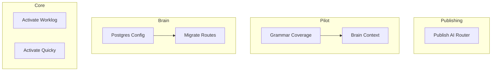

# Implementation Plan — Phase 2: Production Hardening

> **January 2026**  
> Purpose: Polish, publish, and prepare ecosystem for production use

---

## Phase 2 Objectives

1. **Publish** npm packages (dooz-ai-router)
2. **Polish** dooz-pilot (grammar coverage, MCP context)  
3. **Harden** dooz-brain (PostgreSQL production config)
4. **Enable** dooz-core packages (worklog, quicky activation)
5. **Document** deployment procedures

---

## Implementation Units

### Priority 1: Package Publishing

#### Unit PUB-01: Publish dooz-ai-router to npm

| Attribute | Value |
|-----------|-------|
| **Purpose** | Make AI router available as npm package |
| **Inputs** | Source code in dooz-ai-router/ |
| **Outputs** | Published @dooz/ai-router on npm |
| **Done When** | `npm install @dooz/ai-router` works |
| **Effort** | Low (1-2 hours) |

**Steps:**
1. Update package.json version
2. Build dist files
3. Test locally with `npm pack`
4. Publish: `npm publish --access public`

---

### Priority 2: Pilot Improvements

#### Unit PLT-GRAM-01: Expand CLI Grammar Coverage

| Attribute | Value |
|-----------|-------|
| **Purpose** | Add more CLI patterns to cartridge system |
| **Inputs** | cartridges/*.yaml |
| **Outputs** | Enhanced grammar recognition |
| **Done When** | Common commands (npm, git, docker) fully parsed |
| **Effort** | Medium (4-6 hours) |

**Steps:**
1. Audit current cartridges for gaps
2. Add missing git commands (stash, cherry-pick, rebase)
3. Add docker-compose patterns
4. Add bun/deno commands
5. Test with real CLI sessions

#### Unit PLT-BRAIN-01: Brain Context in PTY

| Attribute | Value |
|-----------|-------|
| **Purpose** | Show relevant Brain memories in pilot sidebar |
| **Inputs** | Current working directory, recent commands |
| **Outputs** | Context panel with related memories |
| **Done When** | User sees relevant docs while working |
| **Effort** | Medium (4-6 hours) |

---

### Priority 3: Brain Production Hardening

#### Unit BRN-PG-01: Production PostgreSQL Config

| Attribute | Value |
|-----------|-------|
| **Purpose** | Production-ready Postgres configuration |
| **Inputs** | Current postgres.rs module |
| **Outputs** | Connection pooling, SSL, backups |
| **Done When** | Brain runs reliably with Postgres in production |
| **Effort** | Low (2-3 hours) |

**Steps:**
1. Add SSL/TLS support for connections
2. Add connection pool tuning (max connections, timeout)
3. Add health check endpoint
4. Document backup/restore procedure

#### Unit BRN-ROUTES-01: Migrate Routes to PostgreSQL

| Attribute | Value |
|-----------|-------|
| **Purpose** | Update route handlers to use PgDatabase |
| **Inputs** | Current routes using SQLite |
| **Outputs** | Routes using PostgreSQL for operations |
| **Done When** | All memory/embedding routes use Postgres |
| **Effort** | Medium-High (6-8 hours) |

---

### Priority 4: Core Activation

#### Unit CORE-WL-01: Activate Worklog for DoozieSoft

| Attribute | Value |
|-----------|-------|
| **Purpose** | Enable time tracking for internal use |
| **Inputs** | Worklog package, tenant config |
| **Outputs** | Worklog functional at internal tenant |
| **Done When** | Team can log time entries |
| **Effort** | Low (1 hour) |

#### Unit CORE-QK-01: Activate Quicky for DoozieSoft

| Attribute | Value |
|-----------|-------|
| **Purpose** | Enable quick task management |
| **Inputs** | Quicky package, tenant config |
| **Outputs** | Quicky functional at internal tenant |
| **Done When** | Team can create/manage quick tasks |
| **Effort** | Low (1 hour) |

---

## Dependency Graph

---

## Execution Order

| Order | Unit | Effort | Unlocks |
|-------|------|--------|---------|
| 1 | PUB-01 (AI Router) | Low | External consumption |
| 2 | BRN-PG-01 (PG Config) | Low | Production Brain |
| 3 | CORE-WL-01 + CORE-QK-01 | Low | Internal workflow |
| 4 | PLT-GRAM-01 (Grammar) | Medium | Better CLI parsing |
| 5 | BRN-ROUTES-01 (Routes) | Medium-High | Full Postgres migration |
| 6 | PLT-BRAIN-01 (Context) | Medium | AI-assisted CLI |

---

## Quick Wins (Do First)

- [ ] PUB-01: npm publish @dooz/ai-router
- [ ] BRN-PG-01: Add SSL + connection tuning
- [ ] CORE-WL-01: Run enable-worklog-doozie.php
- [ ] CORE-QK-01: Run enable-quicky-doozie.php

---

*Generated: 2026-01-16*
