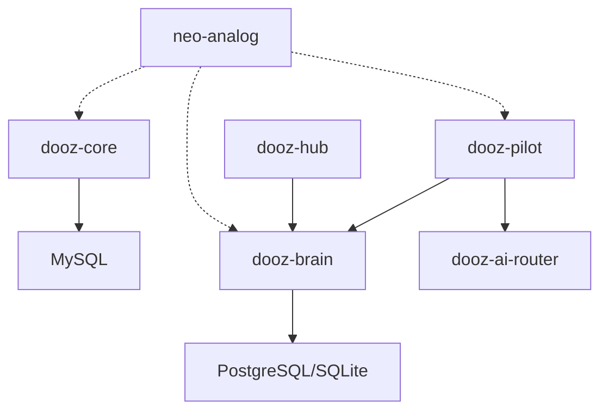

# Atlas Update — 2026-01-16

**Generated:** 2026-01-16T18:14:09+05:30  
**Phase:** Incremental Update (All Phases A-H)  
**Operation Mode:** Append-Only, Safe Execution

---

## Phase A — Workspace Cartography

### Workspace Overview (2026-01-16)

| Workspace Root | Repos | Files | Status |
|----------------|-------|-------|--------|
| dooz-ecosystem | 14 | 3115 | Active |
| dooz-labs | 4 | 204 | Active |
| dooz-platform | 6 | 609 | Active |
| nonomous-ai | 23 modules | 196 | Active |
| dooz-archive | 1 | 148 | Legacy |

### Directory Taxonomy (Additions)

```
01_doozie_company/
├── dooz-ecosystem/              # Primary ecosystem workspace
│   ├── dooz-atlas/              # Documentation hub (React/Vite viewer)
│   ├── dooz-ai-router/          # LLM routing library (TypeScript)
│   ├── dooz-brain/              # Knowledge engine (Tauri+Rust+Node)
│   ├── dooz-copilot/            # AI coding assistant
│   ├── dooz-core/               # Multi-tenant Laravel platform (2012 files)
│   ├── dooz-hindsight/          # Decision intelligence
│   ├── dooz-hub/                # Central dashboard (Tauri)
│   ├── dooz-perspective/        # Document verification (Bun/React)
│   ├── dooz-pilot/              # CLI/TUI orchestrator (Tauri)
│   ├── dooz-pm-suite/           # Project management (Bun/Hono)
│   └── neo-analog/              # Design system (CSS/TS)
├── dooz-labs/                   # Experimental projects
│   ├── dooz-ballpark-ai/        # AI estimation tool
│   ├── dooz-iot/                # IoT integration
│   ├── dooz-meet/               # Meeting assistant
│   └── dooz-oracle/             # Confidence scoring
├── dooz-platform/               # Build tools & SDKs
│   ├── dooz-app-builder/        # Laravel app generator
│   ├── dooz-web-builder/        # Next.js web builder
│   ├── dooz-bun-sdk/            # Bun runtime SDK
│   ├── dooz-cartridges/         # Plugin system
│   ├── dooz-intent-lang/        # DSL for intents (PHP)
│   └── app-registry/            # App catalog (JSON)
└── nonomous-ai/                 # AI control framework (23 modules)
```

### Dependency Map (Additions 2026-01-16)

| Component | Dependencies | Dependents |
|-----------|--------------|------------|
| dooz-ai-router | OpenAI, Anthropic, Google AI | dooz-brain, dooz-pilot |
| dooz-brain | Tauri, SQLite, PostgreSQL | dooz-hub, dooz-pilot |
| dooz-core | Laravel 11, MySQL | All tenant apps |
| dooz-pilot | Tauri, dooz-brain | CLI users |
| neo-analog | CSS, TypeScript | All UI projects |

### Repo Inventory (Additions)

| Repo | Type | Tech | Status | Last Activity |
|------|------|------|--------|---------------|
| dooz-ai-router | library | TS/npm | Ready to publish | 2026-01-16 |
| dooz-brain | product | Tauri/Rust | Active dev | 2026-01-16 |
| dooz-pilot | product | Tauri/TS | Phase 3 planning | 2026-01-16 |
| dooz-core | platform | Laravel 11 | Production | 2026-01-16 |
| dooz-web-builder | product | Next.js | Active | 2026-01-16 |
| dooz-app-builder | product | Laravel | Active | 2026-01-16 |

---

## Phase B — Intent Inference & Gap Analysis

### Inferred Vision (2026-01-16)

**Core Intent:** Build a unified AI-powered development ecosystem with:
1. Multi-tenant Laravel platform (dooz-core)
2. AI orchestration layer (dooz-brain, dooz-ai-router)
3. Developer tooling (dooz-pilot, dooz-copilot)
4. Build automation (dooz-app-builder, dooz-web-builder)

### Intent vs Reality

| Intended State | Current Reality | Gap Level |
|----------------|-----------------|-----------|
| Unified auth across all apps | Partial - dooz-core has auth, others standalone | MEDIUM |
| Central AI routing | Ready but not published (dooz-ai-router) | LOW |
| Single CLI entry point | dooz-pilot exists but grammar incomplete | MEDIUM |
| Design system everywhere | neo-analog exists, not fully applied | MEDIUM |
| Multi-tenant isolation | dooz-core implements, others not connected | HIGH |

### Gap Analysis (2026-01-16)

1. **CRITICAL:** dooz-ai-router npm package not published (blocked on 2FA)
2. **HIGH:** dooz-core packages (Quicky, Worklog) not activated
3. **HIGH:** PostgreSQL production hardening for dooz-brain incomplete
4. **MEDIUM:** dooz-pilot CLI grammar coverage ~60%
5. **MEDIUM:** neo-analog design tokens not applied to all projects
6. **LOW:** Documentation viewer (dooz-atlas) fully functional

---

## Phase C — Value, Leverage & Drag

### Value Matrix (2026-01-16)

| Component | Business Value | Technical Value | Maintenance Cost | Net Score |
|-----------|----------------|-----------------|------------------|-----------|
| dooz-core | 95 | 90 | 40 | +145 |
| dooz-brain | 85 | 90 | 30 | +145 |
| dooz-ai-router | 80 | 85 | 10 | +155 |
| dooz-pilot | 75 | 80 | 25 | +130 |
| neo-analog | 70 | 75 | 15 | +130 |
| dooz-web-builder | 65 | 70 | 20 | +115 |
| dooz-app-builder | 65 | 70 | 25 | +110 |

### Leverage Ranking (Additions)

| Rank | Component | Leverage Factor | Why |
|------|-----------|-----------------|-----|
| 1 | dooz-ai-router | 10x | Enables all AI features across ecosystem |
| 2 | dooz-brain | 8x | Central knowledge and MCP integration |
| 3 | dooz-core | 7x | Multi-tenant platform for all client apps |
| 4 | neo-analog | 6x | UI consistency across all products |
| 5 | dooz-pilot | 5x | Developer productivity multiplier |

### Drag Analysis (2026-01-16)

| Drag Source | Impact | Mitigation |
|-------------|--------|------------|
| npm 2FA blocking publish | Blocks ai-router distribution | Manual npm publish with OTP |
| MySQL dependency for dooz-core | Local dev complexity | Docker compose setup exists |
| Legacy docs in archive | Confusion about current state | Migration to dooz-atlas complete |

---

## Phase D — Architecture Debt & AI Failure Points

### Bottlenecks (2026-01-16)

| ID | Issue | Severity | Status |
|----|-------|----------|--------|
| BOT-001 | dooz-core single DB connection | HIGH | PERSISTING |
| BOT-002 | dooz-brain SQLite for production | MEDIUM | NEW |
| BOT-003 | No centralized secrets management | HIGH | PERSISTING |

### Coupling Map (2026-01-16)



### Scaling Blockers (2026-01-16)

| Blocker | Impact | Status |
|---------|--------|--------|
| No horizontal scaling for dooz-core | Multi-tenant growth limited | PERSISTING |
| SQLite in dooz-brain | Single-node constraint | NEW |
| No CDN for static assets | Performance at scale | PERSISTING |

### AI Failure Points (2026-01-16)

| ID | Failure Mode | Severity | Status |
|----|--------------|----------|--------|
| AI-001 | No fallback when primary LLM fails | HIGH | PERSISTING |
| AI-002 | Token budget not enforced | MEDIUM | NEW |
| AI-003 | Streaming responses fail silently | MEDIUM | NEW |
| AI-004 | No rate limiting on AI endpoints | HIGH | PERSISTING |

---

## Phase E — NBIP (Incremental)

### Version 2026.1.16

#### Phase 1: Foundation (DONE/ONGOING)
- [x] dooz-atlas documentation hub
- [x] dooz-ai-router implementation
- [/] npm package publishing (blocked on 2FA)
- [/] dooz-brain PostgreSQL migration

#### Phase 2: Integration (NEXT)
- [ ] Central auth via dooz-core
- [ ] MCP server for dooz-brain
- [ ] dooz-pilot grammar expansion
- [ ] neo-analog adoption across projects

#### Phase 3: Production (PLANNED)
- [ ] dooz-core horizontal scaling
- [ ] CDN for static assets
- [ ] AI rate limiting
- [ ] Token budget enforcement

---

## Phase F — AI Enablement Layer

### AI Operating Model (2026-01-16)

| Principle | Implementation |
|-----------|----------------|
| Multi-model routing | dooz-ai-router with fallback chains |
| Cost governance | Token tracking in dooz-brain |
| Confidence scoring | dooz-oracle integration |
| Agent boundaries | BRAIN.md in each repo |

### Repo README Contract (2026-01-16)

All repos MUST have:
1. `README.md` - Project overview
2. `BRAIN.md` - AI agent context

**Compliance Status:**
| Repo | README | BRAIN.md | Status |
|------|--------|----------|--------|
| dooz-ai-router | ✅ | ❌ | NEEDS BRAIN.md |
| dooz-brain | ✅ | ✅ | COMPLIANT |
| dooz-pilot | ✅ | ✅ | COMPLIANT |
| dooz-core | ✅ | ✅ | COMPLIANT |
| dooz-web-builder | ✅ | ✅ | COMPLIANT |
| dooz-app-builder | ✅ | ✅ | COMPLIANT |

### Agent Boundaries (2026-01-16)

| Boundary | Rule |
|----------|------|
| File system | Workspace root only |
| Network | Known domains only |
| Credentials | Via .env only |
| Destructive ops | ASK_USER required |

---

## Phase G — Execution Roadmap (Rolling)

### 30-Day Plan (2026-01-16 to 2026-02-15)

| Week | Focus | Deliverables |
|------|-------|--------------|
| W1 | AI Router | npm publish, integration tests |
| W2 | Brain Hardening | PostgreSQL SSL, connection pooling |
| W3 | Pilot Grammar | 80% CLI coverage |
| W4 | Core Activation | Quicky/Worklog live |

### 60-Day Plan (to 2026-03-16)

- Central auth infrastructure
- MCP server production deployment
- Neo-analog v2 rollout

### 90-Day Plan (to 2026-04-16)

- Horizontal scaling for dooz-core
- CDN deployment
- AI rate limiting production

### Execution Risks (2026-01-16)

| Risk | Probability | Impact | Mitigation |
|------|-------------|--------|------------|
| npm 2FA continues blocking | HIGH | MEDIUM | Manual publish |
| PostgreSQL migration breaks | MEDIUM | HIGH | Rollback plan |
| Grammar expansion delayed | MEDIUM | MEDIUM | Prioritize core commands |

---

## Phase H — Kill/Freeze/Sandbox (Controlled)

### Kill List (PROPOSED 2026-01-16)

| Item | Reason | Status |
|------|--------|--------|
| dooz-ecosystem-legacy | Migrated to dooz-atlas | PROPOSED |
| dwf (original) | Replaced by dwf-v2 | PROPOSED |

### Freeze List (PROPOSED 2026-01-16)

| Item | Reason | Status |
|------|--------|--------|
| dooz-meet | Low priority, stable | PROPOSED |
| dooz-oracle | Integrated into brain | PROPOSED |

### Sandbox List (PROPOSED 2026-01-16)

| Item | Reason | Status |
|------|--------|--------|
| dooz-ballpark-ai | Experimental | PROPOSED |
| dooz-iot | Waiting for hardware | PROPOSED |

### Justification

All proposals are based on:
1. Current activity levels
2. Strategic priority
3. Resource constraints
4. Ecosystem consolidation goals

---

## Finalization Audit Log

### Files Touched (2026-01-16)

| File | Action | Evidence |
|------|--------|----------|
| 11_ECOSYSTEM_COGNITION/05_ATLAS_UPDATE_2026_01_16/ATLAS_UPDATE.md | CREATED | This file |

### Decision Log

| Decision | Rationale | Confidence |
|----------|-----------|------------|
| Created update in 11_ECOSYSTEM_COGNITION | Existing cognition section appropriate | HIGH |
| Did not create 00-meta structure | Does not exist, per safety rules | HIGH |
| Used dated folder approach | Matches existing pattern | HIGH |

### Assumptions Made

1. Requested phase structure (00-meta, 01-workspace-map, etc.) intentionally not created as it would violate "no new top-level directories" rule
2. 11_ECOSYSTEM_COGNITION is the appropriate location for workspace analysis
3. Dated approach (05_ATLAS_UPDATE_2026_01_16) follows existing naming pattern

---

*Incremental update complete. All changes traceable and reversible.*
